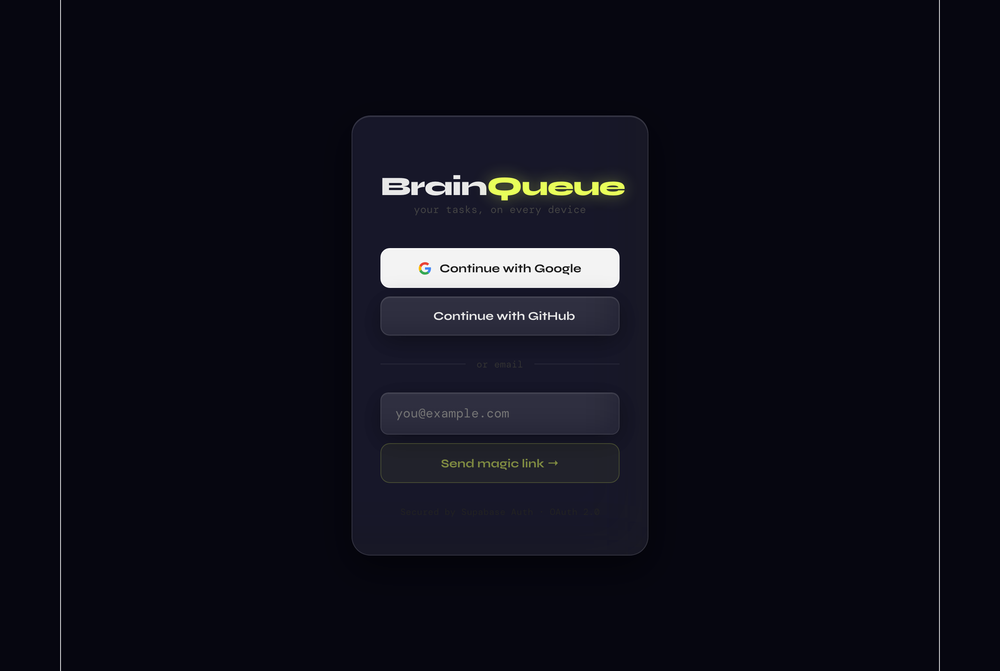
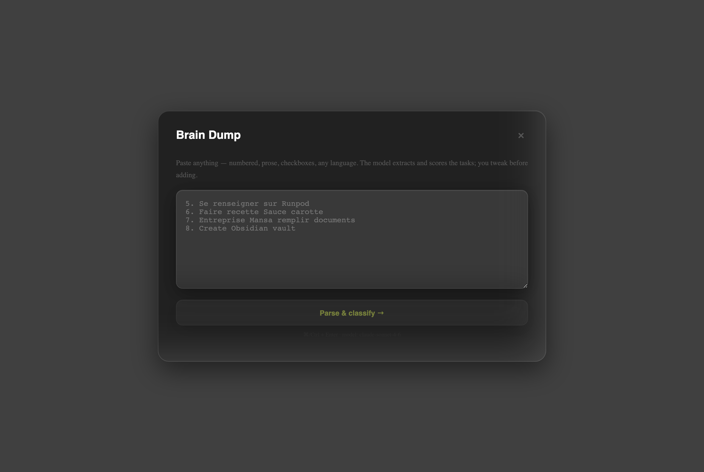
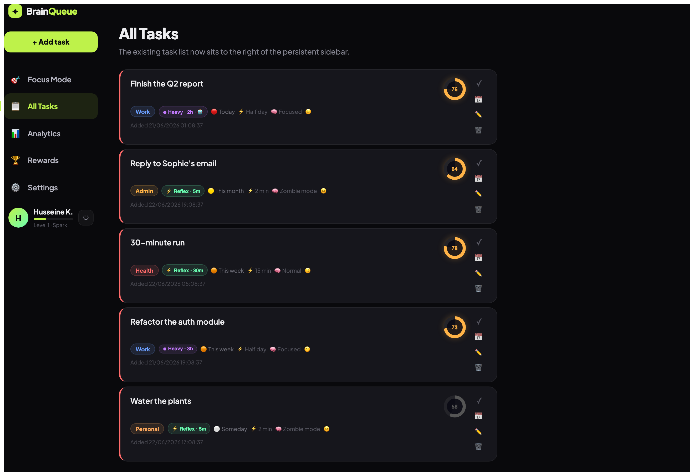
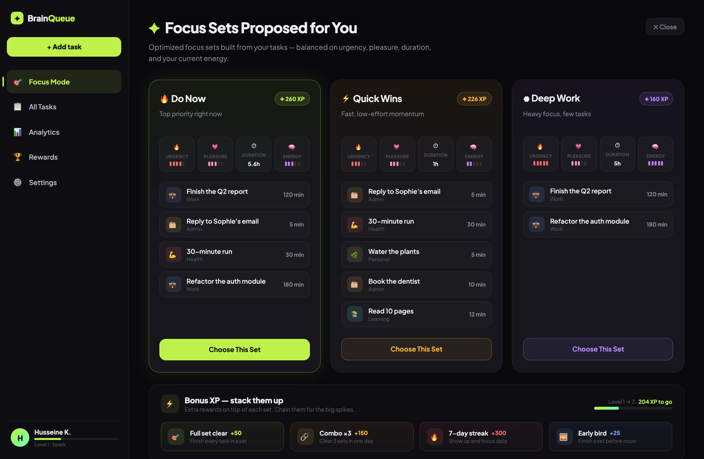
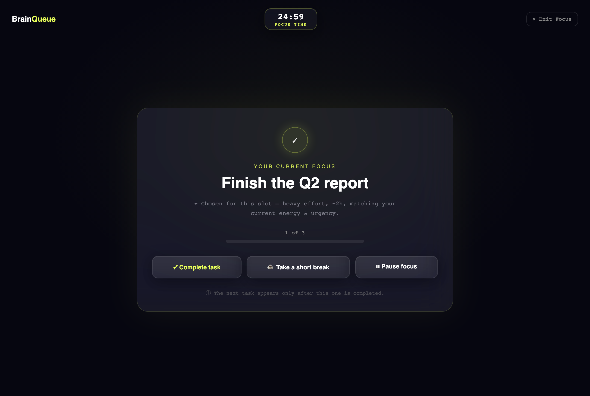
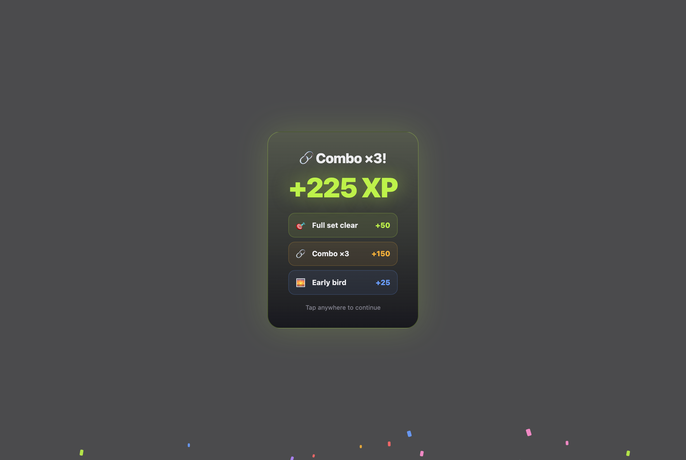
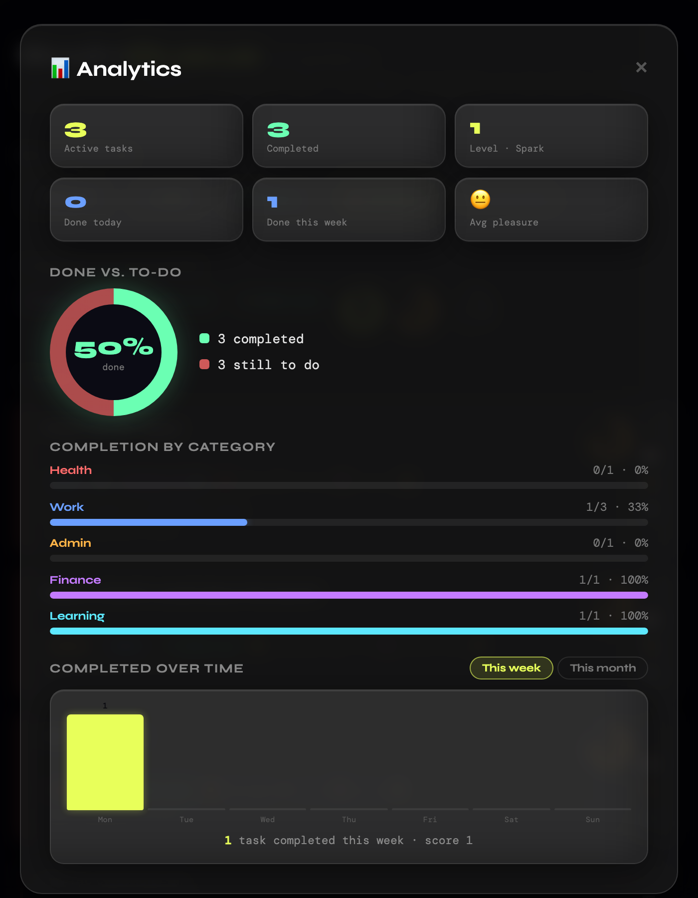
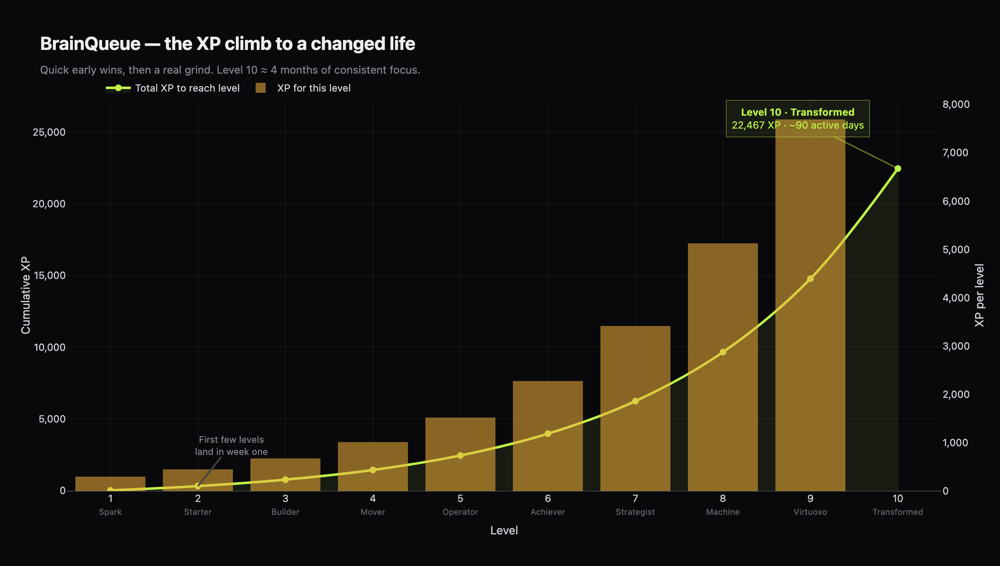

# BrainQueue — Product Workflow & AI Map

A walkthrough of the full user journey (sign-in → finished focus session), and — the point of
this doc — **exactly where AI does and doesn't run today, and where it should run next.**

**The thesis in one line:** capture messy intent → AI structures it → deterministic logic
prioritizes and proposes → the user focuses and is rewarded → telemetry records everything so a
future learning loop can personalize it. The moat is the *behavioral data*, not the AI call.

**Legend:** ✅ AI runs here today · ⚖️ heuristic today, AI is optional · 🔮 AI planned (not built) · ⬜ no AI.

---

## The journey

### 1. Sign in ⬜

Supabase Auth — Google / GitHub OAuth or an email magic link. Row-Level Security scopes every
row to the user; tasks sync across devices in realtime. **No AI.**

---

### 2. Brain Dump → structured tasks ✅ **(the one place AI runs today)**

Paste anything — numbered lists, prose, checkboxes, voice transcripts, mixed languages. One LLM
call turns it into clean, deduplicated, **scored and classified** tasks:

- extracts one task per action, drops non-actionable lines, translates to English
- scores **urgency / importance / effort / energy** (1–5)
- classifies **category, est_minutes, cognitive_load, ai_delegatable, multi_step** (→ the *tier*)

**How it runs:** the browser sends the dump + prompt + JSON schema to the **`brain-dump` Supabase
edge function**, which calls the model server-side (the API key never touches the browser). It's
provider-aware — **`claude-sonnet-4-6`** by default, one-line switchable to **`gpt-4o-mini`** or
others. Structured outputs guarantee valid JSON.
**This is the highest-leverage, highest-frequency AI touchpoint — and a perfect job for a *cheap*
model** (see the cost map). Output lands as the task cards in step 3.

---

### 3. All Tasks ⬜

The AI-classified tasks as cards (category accent, tier badge, priority **score ring**). The
score is computed **deterministically** by `calcScore()` from the AI-supplied dimensions and your
adjustable weights — **no AI per render.** This is where the AI's work from step 2 becomes visible.

---

### 4. Focus Sets proposed ⚖️

Three ready-to-run sets (Do Now / Quick Wins / Deep Work) built from your active tasks, balanced on
urgency / pleasure / duration / energy, each with its XP reward. **Heuristic today**
(`buildProposals` — filter/slice over the scored tasks), framed as "optimized for you."
**AI is optional here** — an LLM could assemble smarter sets ("what you usually finish on a Tuesday
morning"), but it's low-frequency-value and best kept cheap or rule-based for now.

---

### 5. Focus session (Pomodoro) ⬜ *(🔮 future AI zone)*

Full-screen, distraction-free: a calm start "ceremony" scaled to the heaviest task, then a Pomodoro
timer with **Complete · Take a break · Pause**. Pure client-side timer logic — **no AI today.**

> 🔮 **This is where the expensive, valuable AI goes later:** an agent that *does* the
> `ai_delegatable` tasks (drafting, research, coding) while you focus. That's frontier-model,
> metered work — the one part that must be cost-capped.

---

### 6. Set complete → celebration ⬜

Finishing a whole set fires the big reward: confetti + stacked bonuses (full-set clear, combo ×3,
streaks, early-bird) on top of the base XP. Driven by a **deterministic rewards engine**
(`src/lib/rewards.js`) tracking daily set-count + streak in localStorage — **no AI.**

---

### 7. Weekly review ⚖️

A narrative recap that reads your behavior back to you — completion vs last week, capture-to-done
rate, focus time, per-category breakdown, best day, biggest win — in a selectable tone
(kind / motivational / direct / tough love). **Deterministic today:** exact stats + a seeded
phrasing layer (so it *reads* AI-generated and varies week to week, but never hallucinates a
number). **AI is optional** — an LLM-narrated mode could add variety, cheaply (once a week).

---

### 8. Analytics ⬜

Stat cards, done-vs-todo donut, completion-by-category, completions-over-time. All deterministic
from the task log. **No AI.**

---

## Where AI lives (the cost map)

The rule: **frontier models for open-ended generation the user perceives as "the work";
cheap models (or none) for classification, extraction, prioritization, and summarizing structured
data.** At a $14.99/user/month target, the organization layer must round to ~zero so the budget is
free for the execution layer.

| Workflow step | AI today | Recommended model | ~Cost / user / mo |
|---|---|---|---|
| **Brain Dump parse** | ✅ yes | **cheap** — gpt-4o-mini / Haiku 4.5 | $0.05 – 0.40 |
| Prioritization / scoring | ⬜ no (deterministic) | none | $0 |
| Focus Sets | ⚖️ heuristic | none (or cheap) | ~$0 |
| Weekly review | ⚖️ heuristic | none (or cheap, weekly) | ~$0 |
| Analytics / celebration | ⬜ no | none | $0 |
| **Agentic task execution** | 🔮 future | **frontier — Opus / Fable, metered** | the variable — must cap |
| **Learning loop / weekly distillation** | 🔮 future | cheap + Batch API (−50%) | <$0.10 |

Model prices (per 1M tokens) for reference: Fable 5 $10/$50 · Opus 4.8 $5/$25 · Sonnet 4.6 $3/$15 ·
Haiku 4.5 $1/$5 · gpt-4o-mini $0.15/$0.60. **A brain dump on gpt-4o-mini is ~$0.001** — negligible.
A single agentic execution run can be **$0.70–$2.00** — that's the only thing to meter.

**The moat reduces your COGS:** the captured corrections (your own past edits of AI output) become
few-shot context that makes a *cheap* model match a frontier model on *your* data — so you spend
frontier money only on execution, not organization.

---

## The telemetry spine (why every step matters)

Every action above emits an append-only event into `task_events` (with a full envelope: session,
sequence, schema/app version, surface, consent, tz) — `brain_dump_created`, `parse_result` (raw
input **and** raw model output, tokens, cost), per-field `task_edited` corrections,
`task_completed`, `session_completed`, `bonus_earned`, `weekly_review_viewed`, and more. Nothing
reads it yet — that's deliberate. It's the substrate the **learning loop** (🔮) will read to
personalize prioritization and proposals. Capturing it from user #1 is why none of the first week's
data is ever lost.

---

## Feature recap (everything built)

**Capture** — Brain Dump (AI extraction/scoring/classification, server-side, multi-provider) ·
manual task add · categories · recurrence.
**Prioritize** — deterministic score with adjustable weights · tiers (reflex/standard/heavy) ·
effort/energy/cognitive-load classification.
**Focus** — "Focus Sets Proposed for You" (3 sets, per-set XP, choose → session) · full-screen
Pomodoro with calm-start ceremony, breaks, pause · responsive on mobile.
**Reward / gamify** — XP curve (Level 10 "Transformed" ≈ 22.5k XP, ~4 months) · `+XP` pop on each
task · big confetti celebration gated to set-clears / combos / streaks · stackable bonuses.
**Review** — weekly narrative review with selectable tone · analytics dashboard.
**Shell / identity** — persistent sidebar (clear nav, level + XP) · clean Plus Jakarta dark theme ·
migrated task cards.
**Infra** — Supabase Auth + RLS + realtime · telemetry capture v2 (append-only log + registries) ·
Anthropic/OpenAI edge-function proxy (keys server-side only) · `src/ui` component library synced to
claude.ai/design · tag-driven GitHub Releases (now **v2.0.0**) · model eval harness.

### XP curve (reference)

---

*Screens captured from the live login screen and the no-auth component gallery (the in-app flow
screens — Brain Dump, the running session, the weekly review — were rendered against mock data).*
