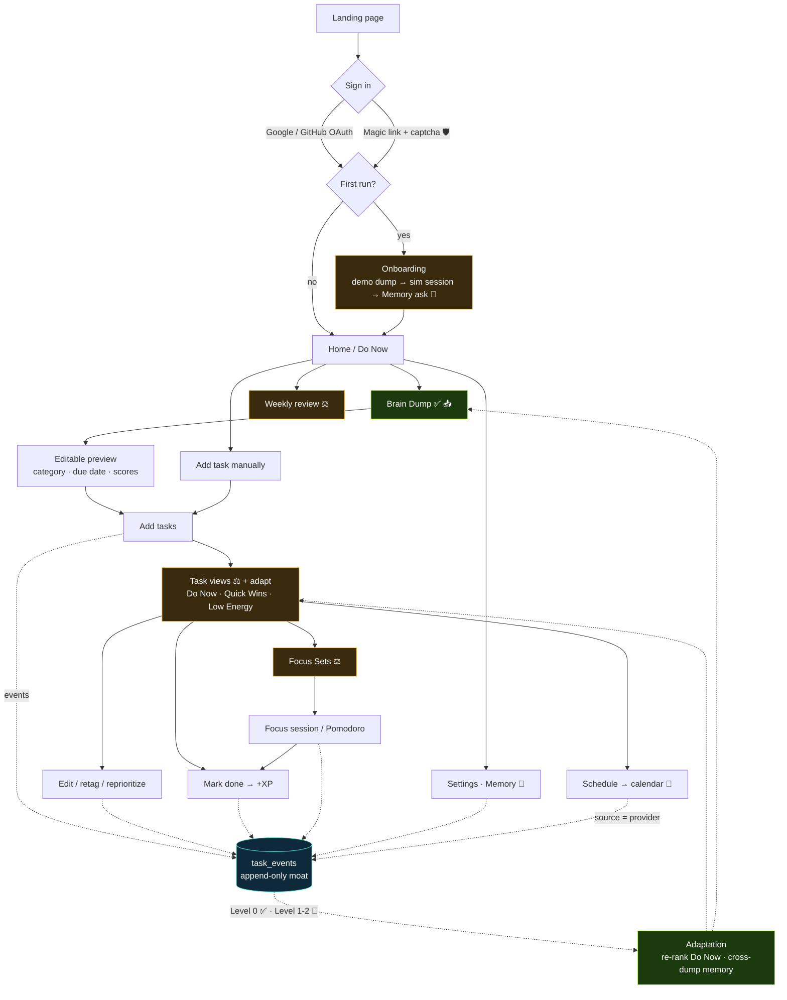

# BrainQueue — Data-flow & AI map

Every route a user can take, **what data each step captures**, and **where an AI layer can
be added**. The append-only `task_events` log is the moat: almost every action drops an event
into it, and the learning loop reads it back.

**Legend:** ✅ AI runs here today · ⚖️ heuristic today (AI optional) · 🔮 AI opportunity (not built) · 🧠 consent/Memory · 📥 raw content captured · 🛡️ security gate.

## What data each route captures, and where to add AI

| Route / step | Data captured (`task_events`) | AI today | 🔮 Where to add an AI layer |
|---|---|---|---|
| **Auth + onboarding** | `onboarding_completed` (Memory choice), `consent_updated` | — | personalize onboarding to first dump |
| **Brain Dump** | `brain_dump_created` (📥 raw text), `parse_requested` (model, prompt_version, `dump_context`), `parse_result` (📥 raw model output, parsed_tasks, tokens, cost), `task_edited` / `task_accepted_unchanged` (corrections), `final_committed` (`final_tasks` + `task_id_map` = the v1→final training pair) | ✅ extraction, scoring, **inferred category**, **due date**, clean notes, **cross-dump context** | few-shot from the user's own corrections · delegation drafting for `ai_delegatable` tasks · first-step breakdown for `multi_step` · confidence-based escalation to a bigger model on hard dumps |
| **Manual add** | `task_created`, `task_features` | — | AI-suggest category + scores as you type |
| **Organize / prioritize** | reads completions; `task_features` | ⚖️ deterministic score **+ Level 0 adaptation** (learned weights, Memory on) | Level 1 context-aware ranking (per-user profile injected) |
| **Focus Sets** | `session_started` (`base_set_ids` → `final_ids`) | ⚖️ heuristic proposals | AI-composed sets matched to your energy, time window, and avoidance |
| **Session / Pomodoro** | `pomodoro_completed`, `break_started/ended`, `session_completed` (`completed_ids`/`planned_ids`), `task_completed`, `bonus_earned` | — | adaptive session length + in-session nudges from your real focus patterns |
| **Schedule → calendar** | calendar event via Google / Microsoft — tagged `source = provider` (**never** used for training) | — | smart time/slot suggestions (kept first-party, not from Google data) |
| **Weekly review** | `weekly_review_viewed` (tone, stats) | ⚖️ templated narrative (deterministic) | LLM-phrased coaching / insights over the week's events |
| **Settings · Memory** | `consent_updated`, `training_data_deletion_requested` | — | — |
| **Learning loop** (background) | *reads* the consented, de-identified log | ✅ **Level 0** (weights) + cross-dump memory | **Level 1** rolling per-user profile · **Level 2** cohort distillation (a small model fine-tuned on aggregate consented data) |

## The two rules that govern the AI layer

1. **Provenance gate.** Only `source = "user"` + `consent_state = "full"` data is training-eligible
   (`consent.isTrainingEligible`), and it's de-identified first (`src/lib/deidentify.js`). Calendar/
   Google/Microsoft data (`source = provider`) is **never** trained on.
2. **Service vs. training.** Using a user's own data to serve *their* experience (cross-dump memory,
   Level 0) needs no consent — it's the service. Using data to improve the *shared* models needs the
   **Memory** opt-in. Add AI on the service side freely; gate the training side on consent.

> The highest-leverage AI additions, in order: **few-shot from corrections** (makes the cheap model
> match a frontier one on *your* data), **delegation drafting** (the paid-tier hook), and **Level 1
> per-user context**. All read the log this map is built around.
